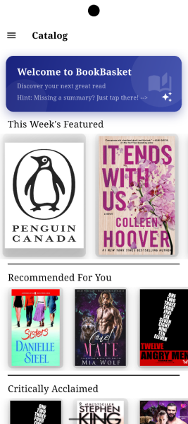
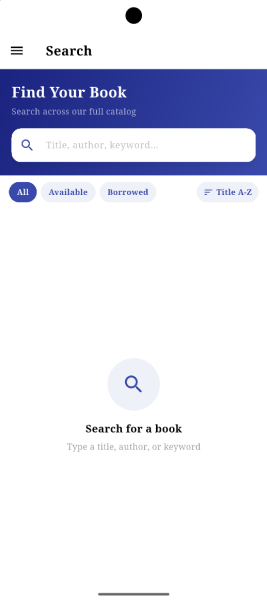
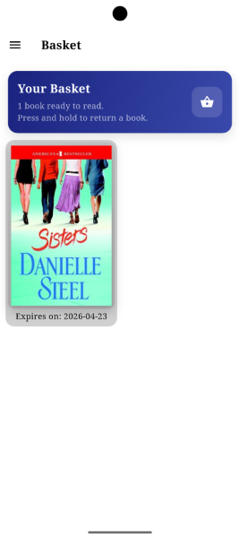
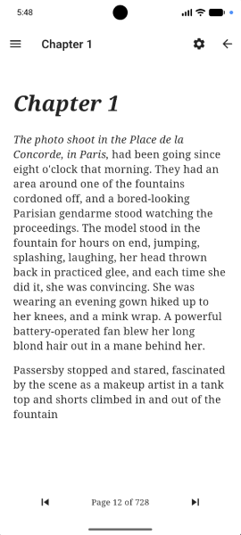
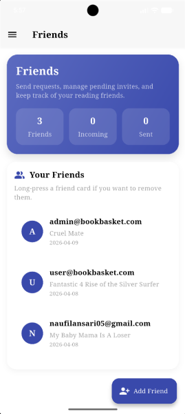
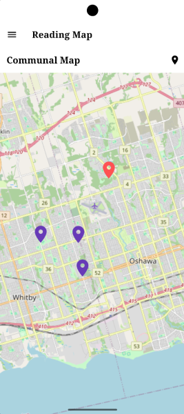
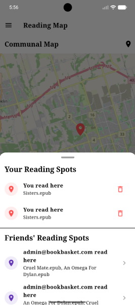
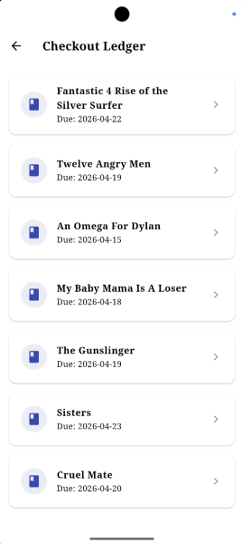
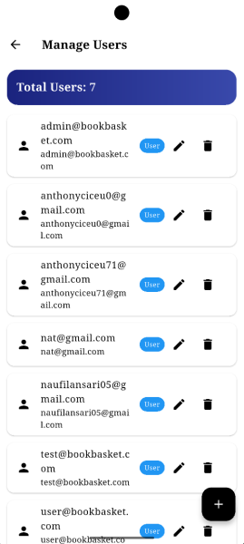

# BookBasket
BookBasket is a digital library app for finding, reading, and sharing books. BookBasket offers a catalog of books for users to borrow and read directly in the app, as well as features to share what they're reading, where they're reading, and what they think of the books they borrow. 

## Features
### Browse the Catalog
Upon logging in, you can view BookBasket's catalog of books, or search the library if you already have something in mind.

 &nbsp; 

### View and Read Your Borrowed Books
Once you've borrowed some books from the BookBasket catalog, you'll be able to view them in your basket. From this screen you can open the e-reader to start reading your borrowed books.

 &nbsp; 

### Connect with Friends
BookBasket lets you connect with friends. Once you've connected with friends, you and your friends can share what you've been reading with each other. 

### See Where You and Your Friends Have Read
Once you've started reading books in BookBasket, you'll start leaving a trail of markers showing what you've read and where on the reading map. You and your friends can also see each others markers on the reading map. 

 &nbsp; 

### Administrator Features
As an administrator, you can manage the books members of your library have checked out. You can also manage members and modify or remove their accounts as needed. 

 &nbsp; 